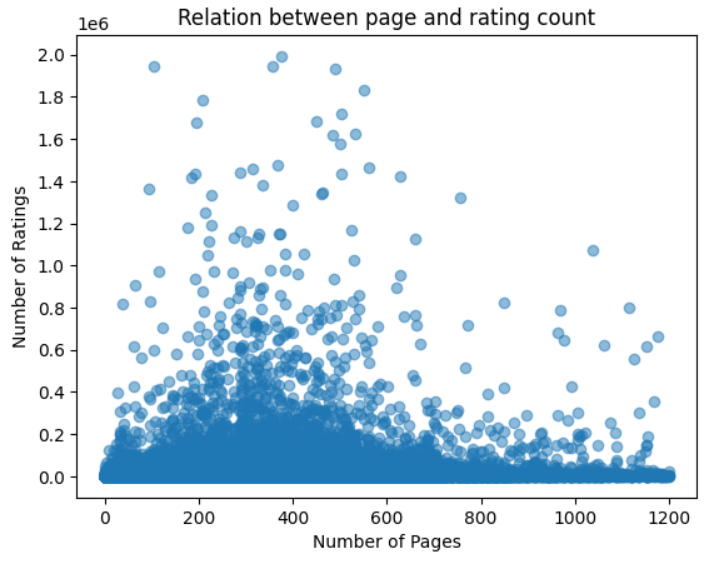
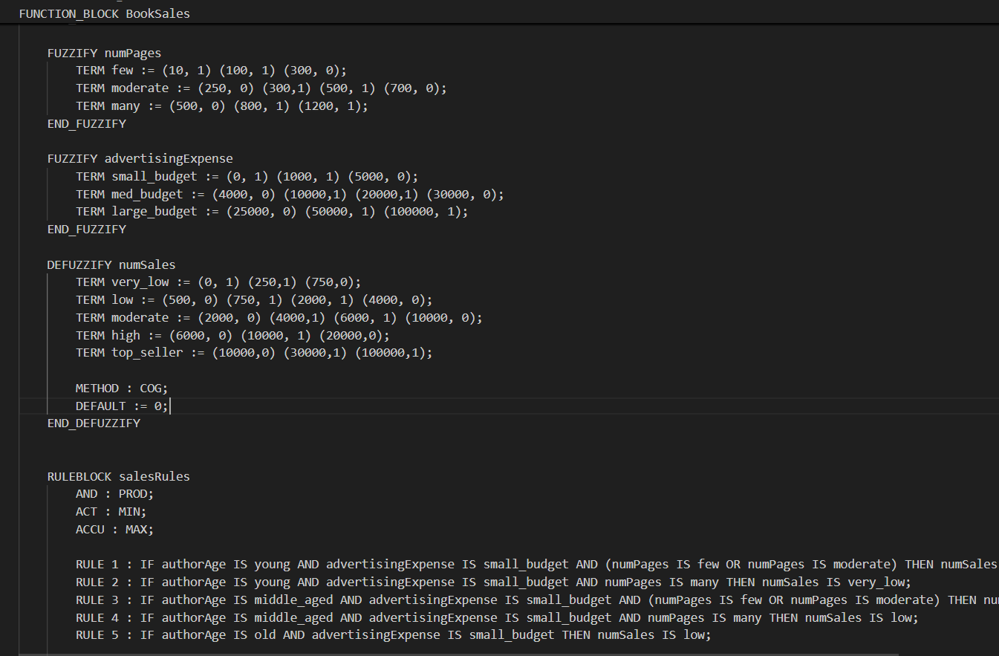

# BookSalesAnalysis with jFuzzyLogic and Python

## Overview

Building an book sales predictor model with Fuzzy Logic, using jFuzzyLogic for fuzzy logic set up and Python for auxilary data science tasks like analysis and visualization.

## Features

- Aim of this repository is to show the main guidelines of building a fuzzy logic model, with example data analysis setup to get better membership functions.
- Java/src folder contains a fcl file that we used to set up our fuzzy logic model. It includes fuzzification, defuzzufication processes, as well as rule block of the model.
- Python folder contains files we used for analyzing the input parameters, and their relation to output variable.
- Java files in Java/src folder is for a basic console app to test out the model's prediction reliability.



## Pre-requisites
- **Java JDK**
- **Python**: Version 3.6+.
  
### Dependencies
- **Python Packages**:
  - `pandas`
  - `numpy`
  - `matplotlib`

### Project Structure
```bash
BookSalesAnalysis_jFuzzyLogic/
├── assets/
├── java/
│       ├── bin/
│       └── src/
├── python/
│   ├── authors_age.txt
│   ├── book_sales.ipynb
│   └── books_dataset.cs
├── .gitignore
└── README.md        
 ```



## Installation
1. Clone the repository:
   ```bash
   git clone https://github.com/OzturkVedat/BookSalesAnalysis_jFuzzyLogic.git
   cd BookSalesAnalysis_jFuzzyLogic

2. Run:
  Open the root folder via your text editor (e.g. VsCode) or IDE (e.g. Eclipse). Run the Prediction.java file to try out the fuzzy logic model.
